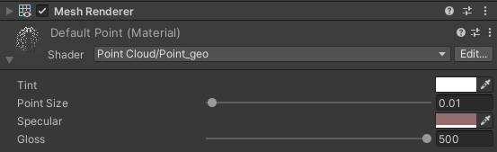

Adaptive Shader for Point Cloud based on PCX
=============================================

   
   

**Adaptive Shader** for PCX is a geometry shader developed in Unity and for Human point cloud rendering. It is used for the course project [Virtual Humans](https://vlg.inf.ethz.ch/teaching/Virtual-Humans.html) taught at ETH Zurich. The codebase is [PCX](https://github.com/keijiro/Pcx)

Features
-------------------
- Efficient human point cloud rendering, for normal project settup and for rendering in VR (120 FPS, tested on oculus quest 2, either wirelessly or wired through link cable, with desktop GTX1660 hardware).
- Unlike Pcx, squares of the point clouds are facing the normals of the original points, instead of facing to the camera.
- Automatic point size adjustment by precomuting a polynomial fitted to the point size function.
- Add Shadow pass and [blinn-phong illumination](https://en.wikipedia.org/wiki/Blinn%E2%80%93Phong_reflection_model) in fragment shader. 

Video Demo
-------------------

System Requirements
-------------------

- Unity 2020.3

Supported Format
-------------------
- Same as [PCX](https://github.com/keijiro/Pcx), only PLY (binary little-endian format) is supported.

How to Import the project
-------------------
In Unity hub, under Projects page:
- Click Open
- Add project from disk
- Find the local path of this project

Point Rendering with adaptive point size
-------------------
Points are rendered as squares with different size using the `Point Cloud/Point_geo` shader

- Tint: Alpha channel of Tint is used for rendering of the point cloud data.
- Point size: deprecated for controling point cloud size and replaced by automatic point size. However, this parameter can still control shadow radius for point clouds.
- Specular: Specular color for Blinn-Phong illumination.
- Gloss: Glossiness parameter for Blinn-Phong illumination.

Future
-------------------
- Embed neural rendering parameter into precomputated textures/spherical harmonics and realize real-time(>90 Fps) online inference.
- Segmentation and Subsurface scattering for human meshes for more realistic skin rendering.

Acknowledgements
-------------------
The point clouds used for development in this project are converted from free meshes (static and animated) in [RenderPeople](https://renderpeople.com/3d-people/). Point clouds importing and converting are using [PCX](https://github.com/keijiro/Pcx)
